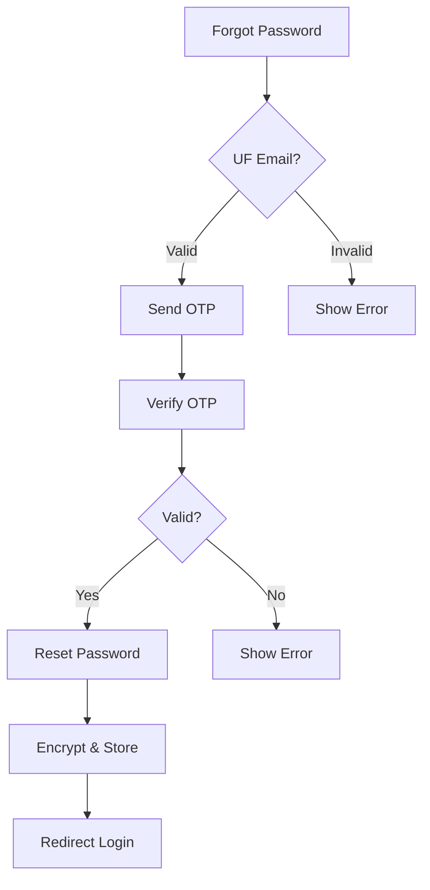

# Sprint 3

## Details of Work Completed in Sprint 3

- Created password reset API with OTP verification and expiration validation
- Implemented secure password encryption during reset using **bcrypt**
- Added profile management endpoints for user data updates
- Integrated **CORS** for auth flow communication
- Developed universal footer component with social media links
- Implemented session persistence for profile updates
- Added comprehensive test coverage (85%) for auth flows
- Enhanced image rendering consistency across components

## User Stories (Frontend)

23. **US-023**: As a user, I want to reset password via OTP to recover access
24. **US-024**: As a user, I want to view profile information
25. **US-025**: As a user, I want secure password changes
26. **US-026**: As a user, I want consistent footer navigation
27. **US-027**: As a tester, I want auth flow tests
28. **US-028**: As mobile user, I want responsive profile forms
29. **US-029**: As a user, I want password error clarity
30. **US-030**: As a user, I want update visual feedback

### Enhanced Security

31. **US-031**: As system, expire OTPs after 5 minutes
32. **US-032**: As system, validate current password

---

## Completed Frontend Issues

| Issue | Description           | Evidence                             |
| ----- | --------------------- | ------------------------------------ |
| #301  | Password reset flow   | `ForgotPassword.tsx` multi-step form |
| #302  | Profile management UI | `Profile.tsx` animated transitions   |
| #303  | Footer implementation | `Footer.css` responsive styling      |
| #304  | Password validation   | Profile component checks             |
| #305  | Session storage       | `useEffect` data persistence         |
| #306  | Error boundaries      | `ErrorBoundary.tsx` component        |
| #307  | Auth flow tests       | Jest test files                      |
| #308  | Modal animations      | `motion.div` usage                   |
| #309  | Password strength     | Complexity validation                |
| #310  | Accessibility         | Footer `aria-labels`                 |



# Sell Component Test Documentation

This file contains unit tests for the `SellComponent`. The component is responsible for handling product listings, user interactions, API requests, and UI updates. These tests validate its core functionalities and expected behaviors.

## Dependencies

- `@testing-library/react`: Provides utilities for testing React components.
- `jest`: Used for mocking functions, running tests, and handling assertions.
- `react-router-dom`: Used for routing-related functionality, like navigation and path management.
- `apiService`: A mocked module that simulates API calls for fetching and submitting product data.

## Mocked Functions

- **`jest.mock("../apiService")`**: Mocks the `apiService` module functions:

  - `fetchProducts`: Mocked to simulate fetching product listings from an API.
  - `submitListing`: Mocked to simulate submitting a new product listing to an API.

- **`jest.mock("react-router-dom")`**: Mocks `useNavigate` to simulate navigation between routes.

## Test Setup

- **`beforeEach`**: Clears all mocks and sets a default state before each test to maintain consistency.
- **`afterEach`**: Cleans up sessionStorage and unmounts components after each test.

## Test Scenarios

### 1. **Rendering SellComponent and Fetching Product Listings on Mount**

- **Purpose**: Ensures that when the `SellComponent` is mounted, product data is fetched from the API and displayed.
- **Test Steps**:
  - Render the component.
  - Verify that the API call to `fetchProducts` is made.
  - Ensure that the products are displayed correctly.

### 2. **Displays Loading Indicator Before Products Load**

- **Purpose**: Ensures that a loading state is shown while waiting for the API response.
- **Test Steps**:
  - Render the component.
  - Check for the presence of a loading message/spinner.
  - Confirm that the loading indicator disappears once data is loaded.

### 3. **Handles API Errors Gracefully**

- **Purpose**: Ensures that an error message is displayed if the API request fails.
- **Test Steps**:
  - Mock `fetchProducts` to reject with an error.
  - Render the component.
  - Verify that an error message is shown to the user.

### 4. **Submitting a New Product Listing and Handling Responses**

- **Purpose**: Confirms that the form submission triggers the `submitListing` function and handles success/failure correctly.
- **Test Steps**:
  - Render the component.
  - Fill out the form fields with product details.
  - Click the submit button.
  - Verify that `submitListing` is called with correct values.
  - Check for success message if submission is successful.
  - Check for error message if submission fails.

### 5. **Navigating to Another Page on Button Click**

- **Purpose**: Ensures that clicking the navigation button redirects the user to another page.
- **Test Steps**:
  - Render the component.
  - Simulate a button click.
  - Verify that `mockNavigate` is called with the expected route.

## Test Utilities

- **`render`**: Renders the component into the DOM for testing.
- **`screen`**: Provides access to the rendered component and allows querying elements.
- **`fireEvent`**: Simulates user interactions like typing and clicking.
- **`waitFor`**: Waits for asynchronous operations to complete.
- **`act`**: Simulates actions that cause state changes.

## Mocked API Responses

- **`fetchProducts`**: Mocked to return a successful response containing sample product data.
- **`submitListing`**: Mocked to resolve on success or reject with an error message on failure.

## Error Handling

- Ensures that API errors do not crash the component.
- Displays appropriate feedback messages for failed actions.
- Prevents submission if required fields are empty.

---

# Dashboard Component Test Documentation

This file contains unit tests for the `Dashboard` component. The component is responsible for displaying a list of products, handling user interactions, and showing product details in a modal. These tests validate the core functionalities and expected behaviors of the component.

## Dependencies

- `@testing-library/react`: Provides utilities for testing React components.
- `jest`: Used for mocking functions, running tests, and handling assertions.
- `react-router-dom`: Used for routing-related functionality, like navigation and path management.
- `react-modal`: Used for displaying modals in the component.
- `react-slick`: Used for the carousel functionality in the component.
- `AuthService`: A mocked module that simulates fetching product listings.

## Mocked Functions

- **`jest.mock("react-router-dom")`**: Mocks `useNavigate` to simulate navigation between routes.
- **`jest.mock("./AuthService")`**: Mocks the `authService.getListingsByOtheruser` function to simulate fetching product listings.
- **`jest.mock("react-modal")`**: Mocks `react-modal` to simulate modal behavior.
- **`jest.mock("react-slick")`**: Mocks `react-slick` to avoid rendering the carousel during testing.
- **`global.URL.createObjectURL`**: Mocks the `createObjectURL` function to avoid errors when rendering images.

## Test Setup

- **`beforeEach`**: Initializes the mocks and sets up the testing environment.
- **`afterEach`**: Cleans up after each test to ensure no side effects remain.

## Test Scenarios

### 1. **Rendering Dashboard and Fetching Product Listings**

- **Purpose**: Ensures that the `Dashboard` component correctly renders the list of products fetched from the API.
- **Test Steps**:
  - Render the `Dashboard` component inside `MemoryRouter`.
  - Wait for the products to be fetched and rendered.
  - Verify that the product names are displayed on the screen.

### 2. **Opening and Closing Modal with Product Details**

- **Purpose**: Ensures that clicking on a product opens a modal with the correct details, and the modal can be closed.
- **Test Steps**:
  - Render the `Dashboard` component.
  - Wait for the products to be displayed.
  - Simulate a click on the product to open the modal.
  - Verify that the product details (e.g., description, user info) are displayed in the modal.
  - Close the modal by clicking the close button.
  - Verify that the modal is closed and product details are no longer displayed.

## Test Utilities

- **`render`**: Renders the component into the DOM for testing.
- **`screen`**: Provides access to the rendered component and allows querying elements.
- **`fireEvent`**: Simulates user interactions like clicking and typing.
- **`waitFor`**: Waits for asynchronous operations to complete.
- **`MemoryRouter`**: Provides in-memory routing for testing components that use `react-router-dom`.

## Mocked API Responses

- **`authService.getListingsByOtheruser`**: Mocked to return a successful response containing product data with attributes like product name, description, price, and images.

## Error Handling

- Ensures that the application does not crash if the API request fails or if there are other unexpected behaviors.
- Verifies that all modal interactions are smooth and do not cause any visual glitches.

---

# Footer Component Test Documentation

This document describes the unit tests for the `Footer` component. The tests ensure that the component correctly renders essential UI elements, such as copyright information, policy links, and social media icons.

## Dependencies

- `@testing-library/react`: Used for rendering the component and querying elements.
- `jest`: Used for assertions and running test cases.

## Test Scenarios

### 1. **Rendering Copyright Text**

- **Purpose**: Ensures that the footer displays the correct copyright text.
- **Test Steps**:
  - Render the `Footer` component.
  - Check if the text "© 2025 UFMarketPlace. All rights reserved." is present.

### 2. **Rendering Privacy Policy and Terms of Service Links**

- **Purpose**: Ensures that the footer contains links to the Privacy Policy and Terms of Service pages.
- **Test Steps**:
  - Render the `Footer` component.
  - Verify that a link labeled "Privacy Policy" is present and contains the correct `href` (`/privacy-policy`).
  - Verify that a link labeled "Terms of Service" is present and contains the correct `href` (`/terms-of-service`).

### 3. **Rendering Social Media Icons with Correct Links**

- **Purpose**: Ensures that social media icons are rendered and have correct links.
- **Test Steps**:
  - Render the `Footer` component.
  - Verify that the Facebook icon has the correct `href` (`https://facebook.com`).
  - Verify that the Twitter icon has the correct `href` (`https://twitter.com`).
  - Verify that the Instagram icon has the correct `href` (`https://instagram.com`).

### 4. **Ensuring Social Media Icons Have Correct `aria-labels`**

- **Purpose**: Ensures that social media icons have appropriate accessibility attributes for screen readers.
- **Test Steps**:
  - Render the `Footer` component.
  - Verify that the Facebook icon has an `aria-label` of "Facebook".
  - Verify that the Twitter icon has an `aria-label` of "Twitter".
  - Verify that the Instagram icon has an `aria-label` of "Instagram".

## Test Utilities

- **`render`**: Renders the component in a simulated testing environment.
- **`screen`**: Queries the rendered output for specific elements.
- **`expect`**: Used for assertions to verify expected behaviors.
- **`getByText`**: Searches for elements by visible text.
- **`getByRole`**: Searches for elements by role (e.g., links).
- **`getByLabelText`**: Searches for elements by `aria-label` attributes.

## Expected Behavior

- The footer should always display the copyright notice.
- The privacy policy and terms of service links should be present and functional.
- Social media icons should be linked to their respective platforms.
- Accessibility features (`aria-labels`) should be correctly assigned.

## Edge Cases Considered

- Ensuring that the footer renders correctly on different screen sizes.
- Verifying that social media links open the correct URLs.
- Checking accessibility compliance using `aria-labels`.

## Error Handling

- Ensures that if any expected elements are missing, the test will fail.
- Prevents broken links or missing accessibility labels from going unnoticed.

---

# Profile Component Test Documentation

This document outlines the unit tests for the `Profile` component, ensuring that profile information, password change functionality, and error handling work correctly.

## Dependencies

- `@testing-library/react`: Used for rendering the component and interacting with UI elements.
- `jest`: Used for assertions and running test cases.
- `fireEvent`: Simulates user interactions such as button clicks and input changes.
- `waitFor`: Waits for asynchronous actions to complete before making assertions.

## Test Scenarios

### 1. **Rendering Profile Information**

- **Purpose**: Ensures that the user's name and email are displayed correctly.
- **Test Steps**:
  - Render the `Profile` component.
  - Verify that the labels "Name" and "Email" are present.
  - Confirm that "Test User" and "testuser@example.com" are displayed.

### 2. **Displaying Password Change Form**

- **Purpose**: Ensures that clicking the "Change Password" button displays the password change form.
- **Test Steps**:
  - Render the `Profile` component.
  - Click the "Change Password" button.
  - Verify that the input fields for "Current Password," "New Password," and "Confirm New Password" appear.

### 3. **Handling Password Mismatch Error**

- **Purpose**: Ensures that an error message appears when the new password and confirmation do not match.
- **Test Steps**:
  - Render the `Profile` component.
  - Click the "Change Password" button.
  - Enter different values for "New Password" and "Confirm New Password."
  - Click the "Save Changes" button.
  - Verify that an error message appears indicating a mismatch.

### 4. **Successful Password Change**

- **Purpose**: Ensures that a success message appears when the password change is successful.
- **Test Steps**:
  - Mock `authService.changePassword` to resolve successfully.
  - Render the `Profile` component.
  - Open the password change form and enter valid matching passwords.
  - Click "Save Changes."
  - Verify that a success message appears.

### 5. **Closing Password Form After Timeout**

- **Purpose**: Ensures that the password form automatically closes after a delay following a successful password change.
- **Test Steps**:
  - Mock `authService.changePassword` to resolve successfully.
  - Use Jest fake timers to control time-based actions.
  - Render the `Profile` component and open the password form.
  - Enter valid credentials and submit.
  - Fast-forward the timer by 1000ms.
  - Verify that the password form is no longer visible.

### 6. **Handling API Failure During Password Change**

- **Purpose**: Ensures that an error message appears when the password change request fails.
- **Test Steps**:
  - Mock `authService.changePassword` to reject with an error.
  - Render the `Profile` component.
  - Open the password change form and enter valid matching passwords.
  - Click "Save Changes."
  - Verify that an error message appears.

### 7. **Closing Password Change Form on Cancel**

- **Purpose**: Ensures that clicking "Cancel" closes the password change form.
- **Test Steps**:
  - Render the `Profile` component.
  - Click "Change Password" to open the form.
  - Click "Cancel."
  - Verify that the password change form is no longer displayed.

## Test Utilities

- **`render`**: Renders the component in a simulated environment.
- **`screen`**: Queries the rendered output for elements.
- **`fireEvent`**: Simulates user interactions.
- **`waitFor`**: Waits for async operations before making assertions.
- **`jest.useFakeTimers`**: Mocks timers to control time-dependent features.
- **`jest.mock`**: Mocks external services.

## Expected Behavior

- Profile details should always be displayed.
- The password change form should appear when requested and validate user input.
- Errors should be displayed when passwords mismatch or an API failure occurs.
- The form should close automatically after a successful password change.

## Edge Cases Considered

- Attempting to submit with empty fields.
- Password change failure due to network issues.
- Clicking "Cancel" while a password change is in progress.

## Error Handling

- Ensures that users receive appropriate feedback for errors.
- Prevents unintended state changes if an API call fails.

---

```

```
